# Rendu de ANGOULA RAPHAEL

Une capture par etape, dans l'ordre. Terminal entier non rogne, invite visible.
Afficher l'historique en graphe quand c'est pertinent.

## Niveau 1
1. Configuration Git

Clone du fork, `origin` vers le depot personnel, `upstream` vers le depot du TP.

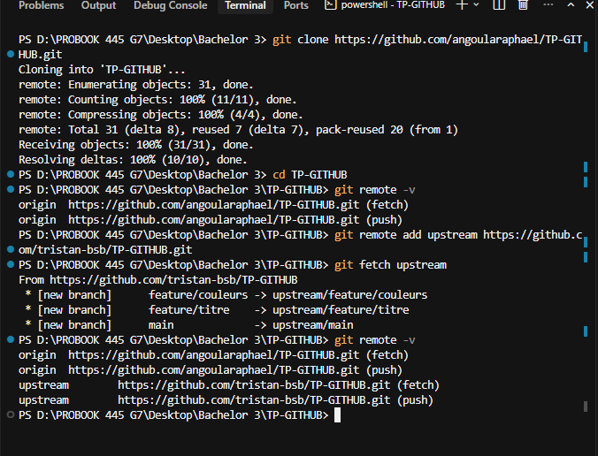

2. Branche de travail

Branche `feature/readme-raphael`, commits atomiques (README puis titre).

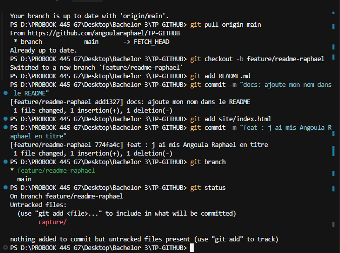

3. Historique des commits

`git log --oneline --graph --all` : branches `main`, `feature/readme-raphael`, `feature/titre`, `feature/couleurs`.

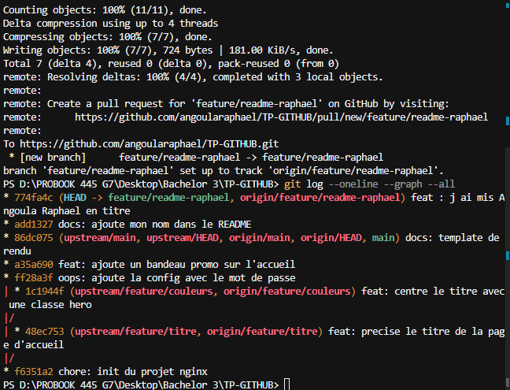

4. Pull Request

PR #1 `feature/readme-raphael` vers `main`.

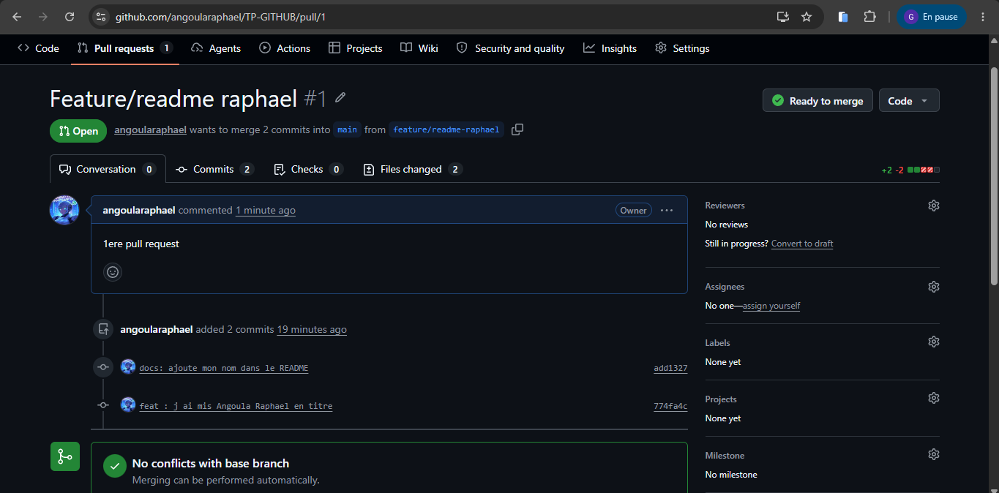

5. Revue croisee

Revue de Kiorrr : approbation, puis merge de la PR #1.

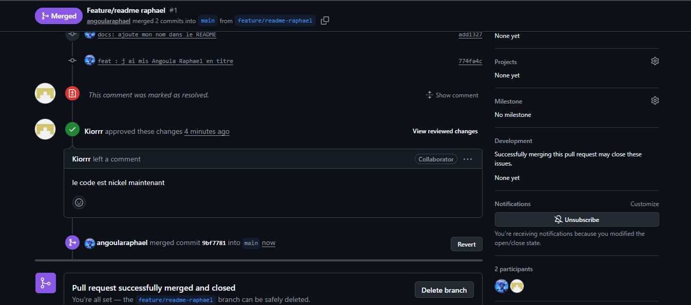

## Niveau 2
6. Secret retire du suivi

`git rm --cached config/secrets.env`, ignore dans `.gitignore`, commit sur `fix/retirer-secrets`.

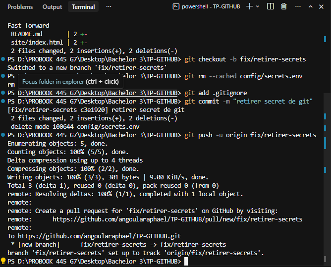

7. Conflit resolu (marqueurs avant, graphe apres)

Marqueurs `<<<<<<<` dans `site/index.html` pendant la fusion de `feature/titre` et `feature/couleurs`.

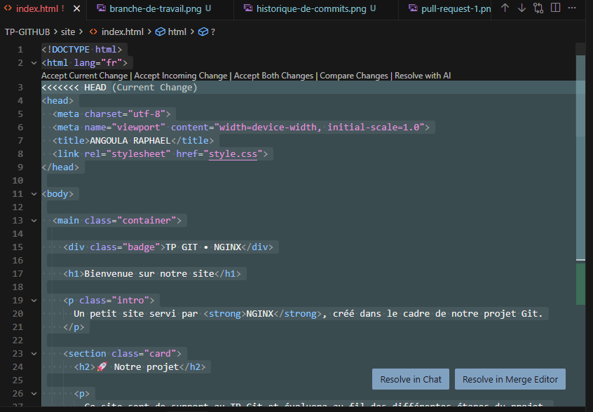

Apres resolution, commit de merge `7391784` sur `merge/titre-couleurs`.

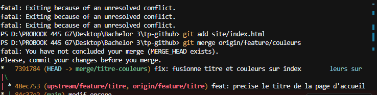

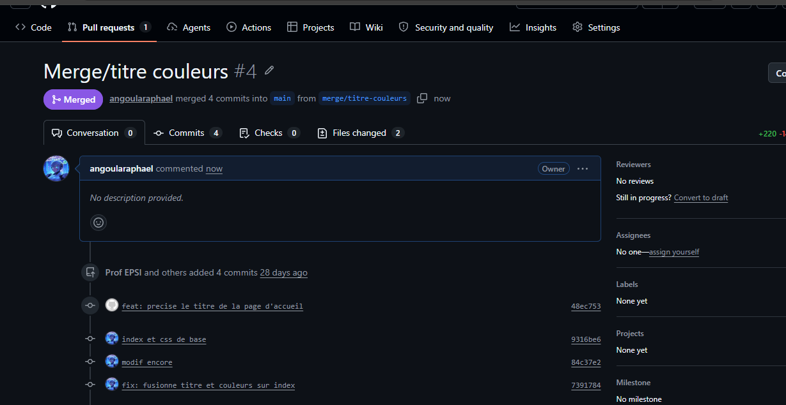

8. Revert du bandeau promo

`git revert a35a690` a produit un conflit, puis commit `6bb68d1` sur `revert/bandeau-promo`.

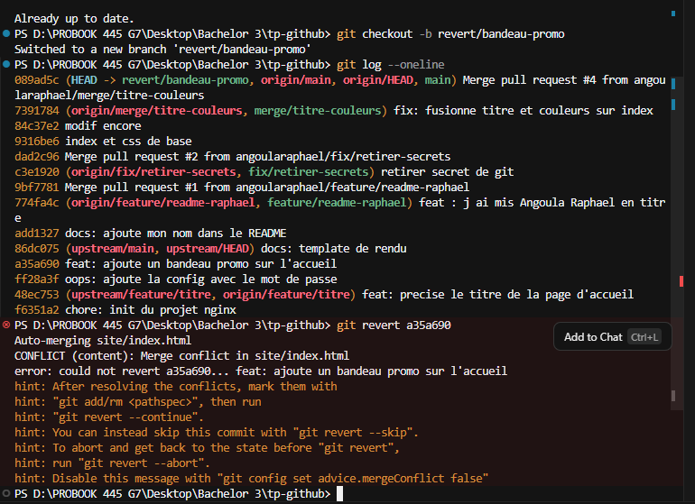

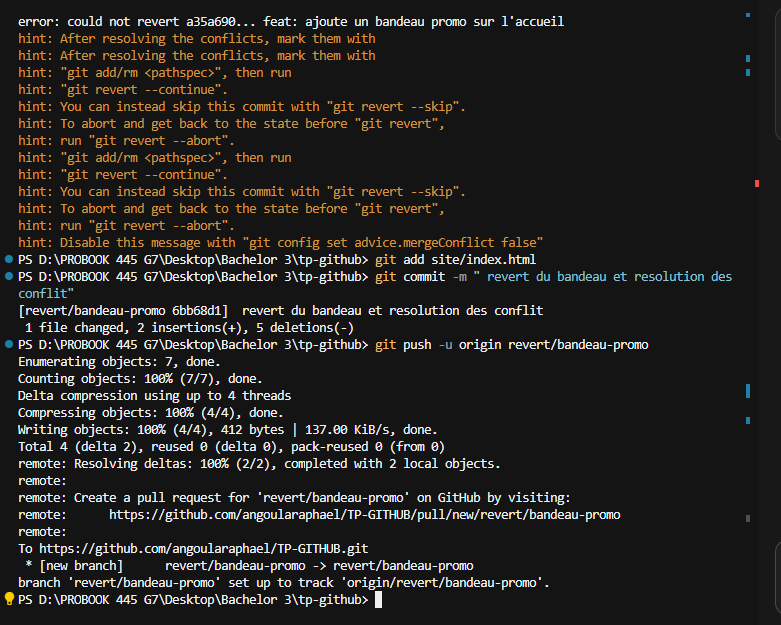

9. Issue fermee par une Pull Request

Issue #6 "Corriger le texte du footer", fermee par la PR #7 (`closes #6`).

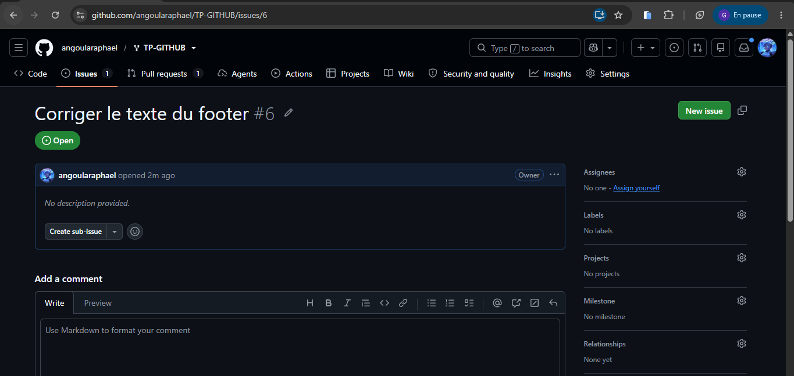

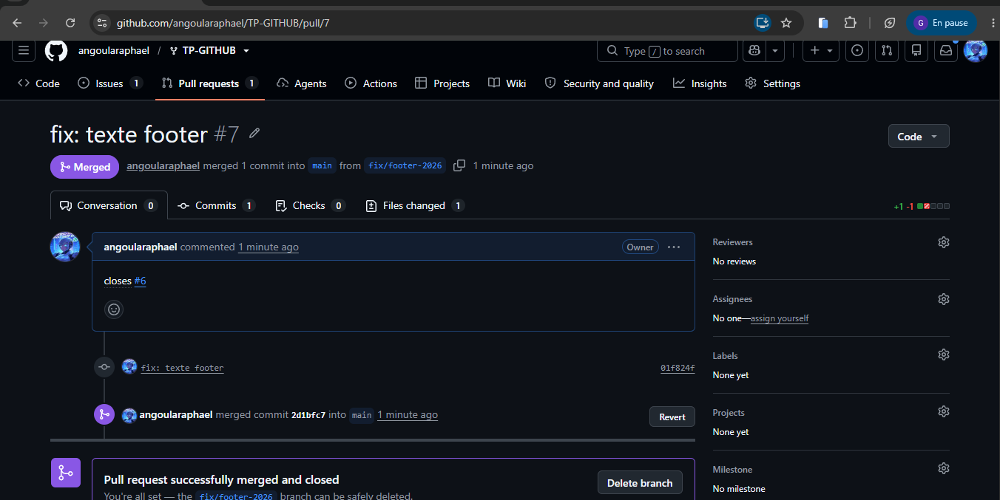

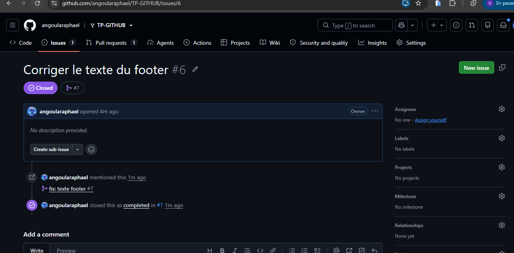

10. Protection de main et CI au vert

Ruleset `protection-main` actif sur `main`. Un push direct est refuse (GH013).

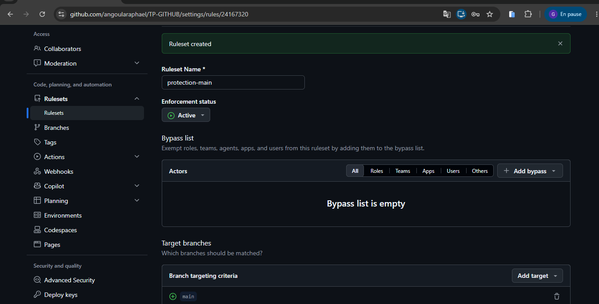

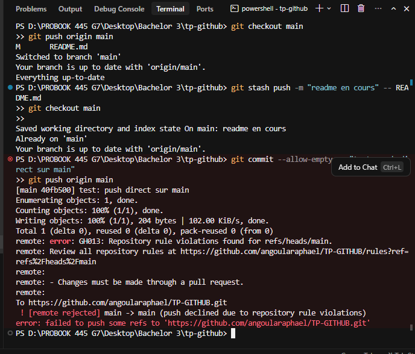

## Cible mobile
11. Commit distant recupere et conflit resolu

`git fetch upstream` puis `git merge upstream/main` sur `sync/upstream` : conflit dans `site/index.html`, resolution, PR #8.

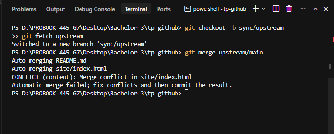

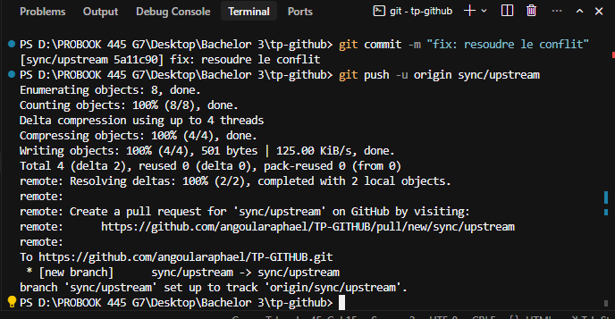

## Trois commits annotes

1. `c3e1920` : retire `config/secrets.env` du suivi Git et l'ajoute au `.gitignore`, sans laisser le mot de passe dans les commits suivants.
2. `7391784` : fusionne `feature/titre` et `feature/couleurs` en resolvant les marqueurs de conflit dans `site/index.html`.
3. `40fb500` : teste un push direct sur `main` ; la ruleset `protection-main` refuse le push et impose une Pull Request.
